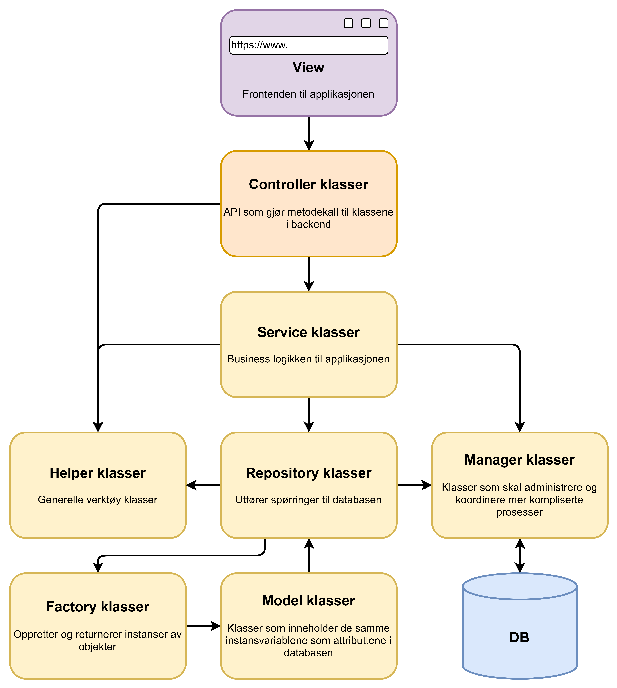

# Dokumentasjon

## Gruppe

**Gruppemedlemmer:**
:
* Ayub Abdirazak Ali - ayubaa@hiof.no
* Jon Petter Harwiss - jonpha@hiof.no
* Mahamoud Ibrahim - mahamoui@hiof.no
* Mats Hansen - math@hiof.no
* Sander Thorstein Nilsen - sandertn@hiof.no

### Ansvarsområder

* Backend (2 stk)
    * Sander
    * Jon
* Frontend
    * Ayub
* Server
    * Mahamoud
* Database + API
    * Mats

## Implementasjon
Vi brukte en del AI for å utvikle nettsiden ut ifra kravene, både for frontend og backend. Vi lagde en database med tabeller med tanke på minimumskraven, og lagde forhold mellom tabellene.

Nettsidene har følgende funksjoner:
* Vi lagde en funksjon hvor man kan registere seg som en student eller en foreleser med de nødvendige dataene ut ifra minimumskraven.
    * Under oppretting av en foreleser, så kan man lage et kurs med kurs pin.
* Vi lagde betinget logikk for registering av forelesere og studenter, så gitt bruker må fylle ut alle felter før registeringen sendes inn.
* Studenten eller foreleser kan logge seg inn. Webserveren kan sammenlignde brukerens oppgitte passord mot hasha passordet fra databasen til gitt epost.
* Student har muligheten til å opprette melding til gitt kurs som en foreleser kan lese og svare tilbake (Kun siste svarte melding vises)
* Studenten og foreleseren har muligheten til å bytte passordet etter å ha logget seg inn.
* Vi la til en glemt-passord funksjon hvor du kun trenger eposten for å tilgangen til å endre passordet igjen. Vi bruker PHPMailer som sender en epost med et link.
* Gjestebruker har muligheten til en kurs med alle meldingene ved bruk av en pin kode samt legge til en kommentar. På denne siden, kan han/hun se kurs navnet, kurs koden, og bildet til foreleseren i kurset
* Gjestebruker kan også rapportere meldinger med begrunnelse.
* Våres 404 håndtering har et easter egg. Lykke til ᓚᘏᗢ
* Input felter har noen form for validering og sanitering
* For nå, så er frontend og backend i et. Dette skal endret snart™️

Vi bruker docker for å teste nettsiden.

## Div

| Funksjonalitet                         | Student | Foreleser | Administrator | Gjestebruker |
|-----------------------------------------|---------|-----------|--------------|--------------|
| **Brukerregistrering**                  | ✅      | ✅        | ❌           | ❌           |
| Registrere navn og e-post               | ✅      | ✅        | ❌           | ❌           |
| Registrere studieretning/studiekull      | ✅      | ❌        | ❌           | ❌           |
| Registrere bilde                         | ❌      | ✅        | ❌           | ❌           |
| Angi undervisningsemne ved registrering  | ❌      | ✅        | ❌           | ❌           |
| **Autentisering og kontoadministrasjon** |         |           |              |              |
| Logge inn                                | ✅      | ✅        | ✅           | ❌           |
| Bytte passord                            | ✅      | ✅        | ❌           | ❌           |
| Glemt passord                            | ✅      | ✅        | ❌           | ❌           |
| **Meldinger og kommunikasjon**           |         |           |              |              |
| Sende anonym melding om et emne          | ✅      | ❌        | ❌           | ❌           |
| Lese egne meldinger og svar              | ✅      | ❌        | ❌           | ❌           |
| Lese meldinger fra studenter i egne emner| ❌      | ✅        | ❌           | ❌           |
| Svare på studentmeldinger (ett svar)     | ❌      | ✅        | ❌           | ❌           |
| **Administratorfunksjoner**              |         |           |              |              |
| Finne ut hvem som har sendt en melding   | ❌      | ❌        | ✅           | ❌           |
| Slette/endre student- og ansattbrukere   | ❌      | ❌        | ✅           | ❌           |
| Slette meldinger og svar                 | ❌      | ❌        | ✅           | ❌           |
| Se rapporterte meldinger                 | ❌      | ❌        | ✅           | ❌           |
| **Gjestebrukerfunksjoner**               |         |           |              |              |
| Se meldinger og svar med PIN-kode        | ❌      | ❌        | ❌           | ✅           |
| Rapportere upassende meldinger           | ❌      | ❌        | ❌           | ✅           |
| Kommentere på meldinger                  | ❌      | ❌        | ❌           | ✅           |
| **Mobilapp-funksjoner (kun for studenter)** | ✅ (uten passordfunksjoner) | ❌ | ❌ | ❌ |
| **API-dokumentasjon**                     | ❌      | ❌        | ✅           | ❌           |

